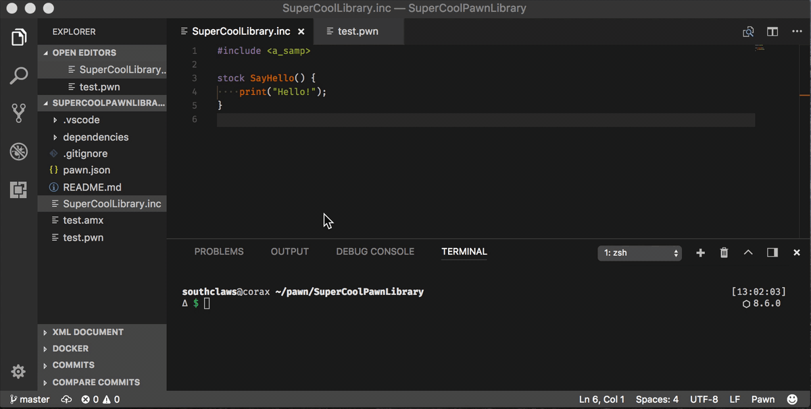

# Packages (Pawn projects)

sampctl treats a Pawn project (gamemode, filterscript, library) as a “package”.

A package is described by `pawn.json` or `pawn.yaml` in the project folder.

## The package file (`pawn.json` / `pawn.yaml`)

A minimal example:

```json
{
  "entry": "gamemodes/main.pwn",
  "output": "gamemodes/main.amx",
  "dependencies": ["pawn-lang/samp-stdlib"]
}
```

Common fields you’ll see:

- `entry`: the `.pwn` file to compile
- `output`: where the `.amx` file should be written
- `dependencies`: GitHub packages to download (includes/libraries)

See also: [Package definition reference](package-definition-reference.md)

## Install and update dependencies

Add a dependency (adds it to `pawn.json` / `pawn.yaml`):

```bash
sampctl install pawn-lang/samp-stdlib
```

Remove a dependency:

```bash
sampctl uninstall pawn-lang/samp-stdlib
```

Download/install what’s listed in your package definition:

```bash
sampctl ensure
```


Update cached dependencies to their latest versions:

```bash
sampctl ensure --update
```

By default, dependencies are cloned into `./dependencies/`.

## Build

Compile the package:

```bash
sampctl build
```


Useful build flags:

- `--watch`: rebuild when files change
- `--dryRun`: show the build command without running it

See also: [Build configuration reference](build-configuration-reference.md)

## Run

Run the package output in a runtime (SA:MP or open.mp):

```bash
sampctl run
```

You can run in a Linux container:

```bash
sampctl run --container
```



See also:

- [Dependencies and version pinning](dependencies.md)
- [Testing (watch mode, runtime modes)](testing.md)
- [Containers (Docker)](containers.md)

## Get a package from GitHub

Clone a GitHub package and ensure dependencies:

```bash
sampctl get Southclaws/formatex
```

## Templates

Templates let you run a file inside a predefined package template:

```bash
sampctl template make my-template
sampctl template build my-template test.pwn
sampctl template run my-template test.pwn
```

## Publishing (release)

If you maintain a package repo and want to create a versioned release:

```bash
sampctl release
```

This is intended for package maintainers.
